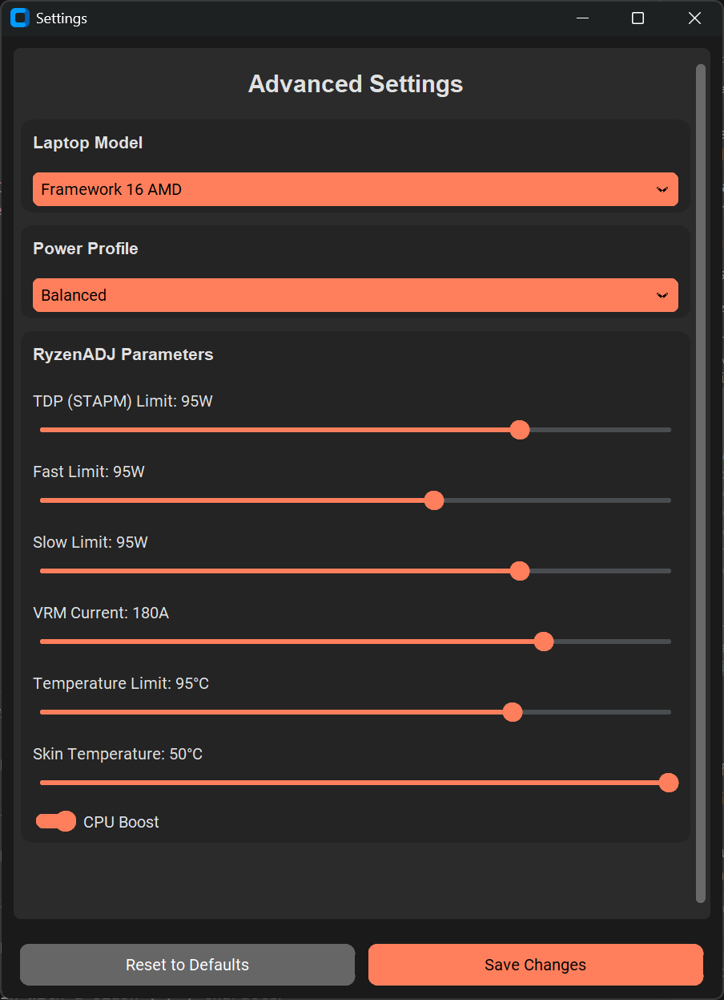
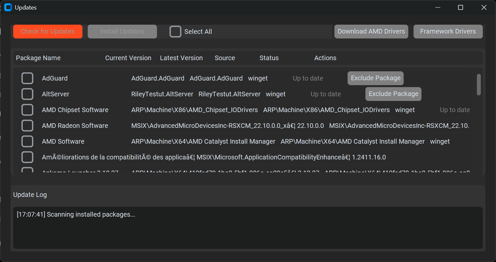

# Framework Laptop Hub Mini

<div align="center">


A lightweight yet powerful control center for Framework AMD laptops, focusing on performance and battery optimization.

[English](#english) | [Français](#français)


</div>

## English

### 🎯 Overview

Framework Hub Mini is a streamlined power management tool designed specifically for Framework AMD laptops. Built with Python and modern UI components, it offers essential controls for optimizing your laptop's performance and battery life through an elegant, minimalist interface.

### 📸 Available Versions

- **Python Edition**
  - Open source version
  - Full source code access
  - Community-driven development
  - Manual dependency management

- **Compiled Executable** ([Available on Patreon](https://patreon.com/Oganoth))
  - One-click installation
  - Pre-configured dependencies
  - Automatic updates
  - Priority support
  - Additional features

### 📸 Screenshots

<div align="center">
<table>
<tr>
<td></td>
<td></td>
<td></td>
</tr>
<tr>
<td align="center">Main Interface</td>
<td align="center">Settings</td>
<td align="center">Updates</td>
</tr>
</table>
</div>

### ✨ Key Features

#### Power Management
- **Intelligent Power Profiles**
  - Framework 13 (7640U/7840U):
    - Silent/ECO (15W TDP)
    - Balanced (30W TDP)
    - Boost (60W TDP)
  - Framework 16 (7840HS/7940HS):
    - Silent/ECO (30W TDP)
    - Balanced (95W TDP)
    - Boost (120W TDP)

#### Display Control
- **Dynamic Refresh Rate Management**
  - Auto-switching based on power source
  - Framework 13: 60Hz/120Hz
  - Framework 16: 60Hz/165Hz
- **Brightness Control**
  - Hardware-level adjustment
  - Hotkey support

#### Battery Optimization
- **Advanced Charging Control**
  - Customizable charge limit (60-100%)
  - Battery longevity optimization
  - Real-time status monitoring

#### System Monitoring
- **Real-time Performance Metrics**
  - CPU usage and temperature
  - RAM utilization
  - Power consumption tracking
  - GPU metrics (integrated & discrete)

### 🛠️ Installation

#### Python Edition
1. Clone the repository
2. Install dependencies: `pip install -r requirements.txt`
3. Run `python mini.py`

#### Compiled Executable
1. Get access through [Patreon](https://patreon.com/Oganoth)
2. Download the installer
3. Run the setup wizard
4. Launch from Start Menu or Desktop shortcut

### 📋 System Requirements

- Windows 11 (22H2 or later)
- 4GB RAM
- 100MB disk space
- Administrator privileges
- .NET Framework 4.8
- Visual C++ Redistributable 2015-2022

### 📸 Screenshots

<div align="center">
<table>
<tr>
<td></td>
<td></td>
</tr>
<tr>
<td align="center">Main Interface</td>
<td align="center">Settings Window</td>
</tr>
</table>
</div>

### ✨ Key Features

#### Power Management
- **Intelligent Power Profiles**
  - Framework 13 (7640U/7840U):
    - Silent/ECO (15W TDP)
    - Balanced (30W TDP)
    - Boost (60W TDP)
  - Framework 16 (7840HS/7940HS):
    - Silent/ECO (30W TDP)
    - Balanced (95W TDP)
    - Boost (120W TDP)

#### Display Control
- **Dynamic Refresh Rate Management**
  - Auto-switching based on power source
  - Framework 13: 60Hz/120Hz
  - Framework 16: 60Hz/165Hz
- **Brightness Control**
  - Hardware-level adjustment
  - Hotkey support

#### Battery Optimization
- **Advanced Charging Control**
  - Customizable charge limit (60-100%)
  - Battery longevity optimization
  - Real-time status monitoring

#### System Monitoring
- **Real-time Performance Metrics**
  - CPU usage and temperature
  - RAM utilization
  - Power consumption tracking

#### User Experience
- **Modern Interface**
  - System tray integration
  - Global hotkey (F12)
  - Clean, intuitive design
- **Automatic Model Detection**
  - CPU-based laptop model identification
  - Profile auto-configuration

### 🛠️ Technical Details

#### Dependencies
```python
customtkinter==5.2.0    # Modern UI components
Pillow==10.0.0         # Image processing
psutil==5.9.5          # System monitoring
pywin32==306           # Windows API integration
requests==2.31.0       # Network operations (WIP)
wmi==1.5.1             # Hardware information
keyboard==0.13.5       # Hotkey support
pystray==0.19.4        # System tray integration
```

#### Architecture
- **Core Components**
  - `SystemMonitor`: Hardware monitoring and metrics
  - `MiniFrameworkHub`: Main application logic
  - `SettingsWindow`: Configuration interface
  - `UpdateWindow`: Driver update management (WIP)

#### Key Technologies
- RyzenADJ integration for power management
- WMI for hardware interaction
- Modern CTk-based UI
- Multi-threaded monitoring system

### 📥 Installation

1. Download the latest release
2. Run the installer with administrator privileges
3. Access via:
   - Desktop shortcut
   - Start menu
   - System tray (F12)

### 🔧 Usage

1. **Launch**: Press F12 or use system tray icon
2. **Configure**:
   - Select laptop model (auto-detected)
   - Choose power profile
   - Set refresh rate
   - Adjust battery limits
3. **Monitor**: Track system performance in real-time

### 🤝 License

Framework Hub Mini is free and open source software licensed under the GNU General Public License v3.0 (GPL-3.0). This means:

- ✅ You can use, modify, and distribute this software freely
- ✅ If you modify and distribute it, you must:
  - Keep it open source
  - License it under GPL-3.0
  - Provide attribution
  - State your changes

[View the full license](LICENSE)

### 🤝 Contributing

Contributions are welcome! Feel free to:
- Submit issues and bug reports
- Propose new features
- Create pull requests
- Share your improvements

Check out our [Contributing Guidelines](CONTRIBUTING.md) to get started.

### ❤️ Support the Project

If you find Framework Hub Mini useful and would like to support its development, you can become a patron! Your support helps me maintain and improve the project, while keeping my cats well fed 😺

[](https://patreon.com/Oganoth?utm_medium=unknown&utm_source=join_link&utm_campaign=creatorshare_creator&utm_content=copyLink)

A huge thank you to all patrons who make this project possible! ❤️

### ❤️ Acknowledgments

- **[JamesCJ60](https://github.com/JamesCJ60)** - Original concept inspiration
- **[FlyGoat](https://github.com/FlyGoat)** - RyzenADJ development

---

## Français

### 🎯 Aperçu

Framework Hub Mini est un outil de gestion d'énergie optimisé pour les ordinateurs portables Framework AMD. Développé en Python avec une interface moderne, il offre les contrôles essentiels pour optimiser les performances et l'autonomie de votre ordinateur portable via une interface minimaliste et élégante.

### 💻 Versions Disponibles

- **Édition Python**
  - Version open source
  - Accès au code source complet
  - Développement communautaire
  - Gestion manuelle des dépendances

- **Exécutable Compilé** ([Disponible sur Patreon](https://patreon.com/Oganoth))
  - Installation en un clic
  - Dépendances préconfigurées
  - Mises à jour automatiques
  - Support prioritaire
  - Fonctionnalités additionnelles

### 📸 Captures d'écran

<div align="center">
<table>
<tr>
<td></td>
<td></td>
<td></td>
</tr>
<tr>
<td align="center">Interface Principale</td>
<td align="center">Paramètres</td>
<td align="center">Mises à jour</td>
</tr>
</table>
</div>

### ✨ Fonctionnalités Clés

#### Gestion de l'Alimentation
- **Profils Intelligents**
  - Framework 13 (7640U/7840U):
    - Silencieux/ECO (15W TDP)
    - Équilibré (30W TDP)
    - Performance (60W TDP)
  - Framework 16 (7840HS/7940HS):
    - Silencieux/ECO (30W TDP)
    - Équilibré (95W TDP)
    - Performance (120W TDP)

#### Contrôle de l'Affichage
- **Gestion Dynamique du Taux de Rafraîchissement**
  - Commutation automatique selon l'alimentation
  - Framework 13: 60Hz/120Hz
  - Framework 16: 60Hz/165Hz
- **Contrôle de la Luminosité**
  - Ajustement matériel
  - Support des raccourcis clavier

#### Optimisation de la Batterie
- **Contrôle Avancé de la Charge**
  - Limite de charge personnalisable (60-100%)
  - Optimisation de la longévité
  - Surveillance en temps réel

#### Surveillance Système
- **Métriques en Temps Réel**
  - Utilisation et température CPU
  - Utilisation de la RAM
  - Suivi de la consommation
  - Métriques GPU (intégré & dédié)

### 🛠️ Installation

#### Édition Python
1. Cloner le dépôt
2. Installer les dépendances: `pip install -r requirements.txt`
3. Exécuter `python mini.py`

#### Exécutable Compilé
1. Accéder via [Patreon](https://patreon.com/Oganoth)
2. Télécharger l'installateur
3. Lancer l'assistant d'installation
4. Démarrer depuis le Menu Démarrer ou le raccourci bureau

### 📋 Configuration Requise

- Windows 11 (22H2 ou ultérieur)
- 4GB RAM
- 100MB d'espace disque
- Privilèges administrateur
- .NET Framework 4.8
- Visual C++ Redistributable 2015-2022

### 🔧 Utilisation

1. **Lancement**: Appuyez sur F12 ou utilisez l'icône de la barre des tâches
2. **Configuration**:
   - Sélection du modèle (détection automatique)
   - Choix du profil d'alimentation
   - Réglage du taux de rafraîchissement
   - Ajustement des limites de batterie
3. **Surveillance**: Suivi des performances en temps réel

### 🤝 Licence

Framework Hub Mini est un logiciel libre sous licence GNU GPL v3.0. Cela signifie :

- ✅ Utilisation, modification et distribution libres
- ✅ En cas de modification et distribution :
  - Conserver l'open source
  - Licence GPL-3.0
  - Attribution requise
  - Mention des modifications

[Voir la licence complète](LICENSE)

### ❤️ Soutenir le Projet

Si vous trouvez Framework Hub Mini utile, vous pouvez devenir mécène ! Votre soutien aide au développement du projet et à nourrir mes chats 😺

[](https://patreon.com/Oganoth)

Un grand merci à tous les mécènes qui rendent ce projet possible ! ❤️
