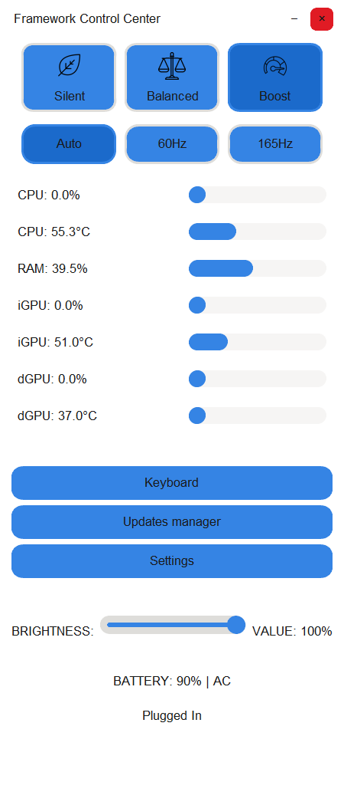
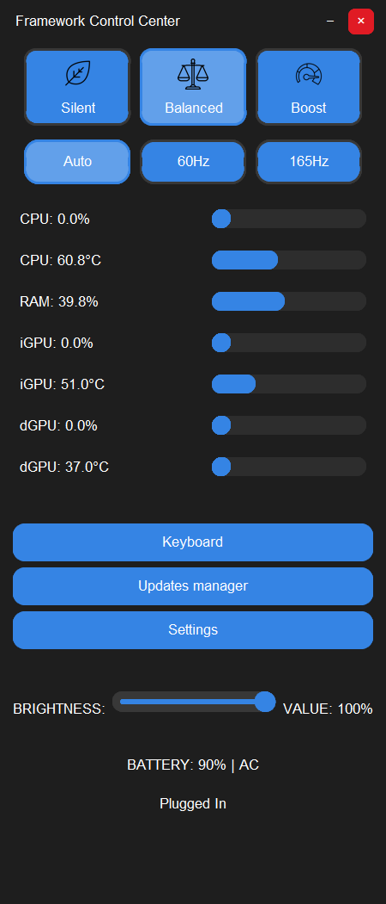

# Framework Hub Mini

<div align="center">

<div style="background-color: #1a1b1e; padding: 20px; border-radius: 8px;">


</div>

<div style="margin: 20px 0;">
Built with ❤️ by <a href="https://patreon.com/Oganoth">Oganoth</a>
</div>

<div style="margin: 30px 0;">

## 🙏 Special Thanks to Our Amazing Patrons

A heartfelt thank you to those who make this project possible:

- **Nirav Patel** _(Founder of Framework Laptop)_ - Your support as a patron is a great honor. Without you, this project would not be possible.
- Jonathan Webber
- retr0sp3kt
- Lysithea2802
- Peter Ansorg
- Jake Rogers

<a href="https://patreon.com/Oganoth">
  
</a>

</div>

<div style="margin: 20px 0;">

[English](#english) • 
[Français](#français) • 
[Features](#-key-features) • 
[Install](#-installation) • 
[Usage](#-usage) • 
[Contribute](#-contributing) • 
[Support](#-support)

</div>

</div>

<hr>

## English

### 🎯 Overview

Framework Hub Mini is a powerful system management tool designed specifically for Framework AMD laptops. Built with Python and modern UI components, it provides comprehensive control over power management, performance optimization, and hardware monitoring through an elegant, feature-rich interface.

### 📸 Screenshots

<div align="center">
<p float="left">
  
  
  
</p>
<p float="left">
  
  
</p>

<em>Framework Hub Mini in action - Modern UI with multiple themes, system management, and monitoring capabilities</em>
</div>

### ✨ Key Features

### 🎨 Power Management
- Windows power plan synchronization
- RyzenAdj integration for AMD models
- Automatic hardware detection
- Real-time power monitoring
- System tray integration

### 💻 Hardware Monitoring

#### Real-time Metrics
- CPU usage and temperature
- RAM usage monitoring
- iGPU metrics (AMD Radeon)
- dGPU metrics (if available)
- Battery status and time remaining
- LibreHardwareMonitor integration
- Automatic sensor detection
- 1-second refresh rate (by default)

### 🎨 Theme System

#### Built-in Themes
- **Default Dark**: Modern dark theme with orange accents
- **Fedora Dark**: GNOME-inspired dark theme with blue accents
- **Fedora Light**: Clean light theme based on GNOME

#### Theme Features
- Complete UI customization
- Color schemes for all elements
- Font configuration (family and sizes)
- Spacing and border radius control
- Real-time theme switching

For detailed information about creating and customizing themes, check out our [Theming Guide](Theming_guide.md).

### ⚡ System Features

#### AMD Power Profiles
- **Framework 13 AMD (7840U)**:
  - Silent/ECO: STAPM 15W, Fast 20W, Slow 15W
  - Balanced: STAPM 25W, Fast 30W, Slow 25W
  - Boost: STAPM 28W, Fast 35W, Slow 28W
- **Framework 16 AMD (7840HS/7940HS)**:
  - Silent/ECO: STAPM 30W, Fast 35W, Slow 30W
  - Balanced: STAPM 95W, Fast 95W, Slow 95W
  - Boost: STAPM 120W, Fast 120W, Slow 120W

#### Power Features
- RyzenADJ integration for AMD models
- Windows power plan synchronization (Silent/Balanced/Performance)
- Temperature limits management
- VRM current control
- Automatic hardware detection


#### Updates Manager
- System package tracking
- Winget integration
- Automatic updates detection
- Batch update installation
- Version comparison
- Update history logging

#### Power Management
- **Silent/ECO Mode**:
  - Processor throttling: 5-30%
  - Power saving graphics
  - Aggressive power saving settings
  - Optimized for battery life
- **Balanced Mode**:
  - Processor throttling: 10-99%
  - Moderate boost settings
  - Balanced power/performance
  - Dynamic GPU switching
- **Boost Mode**:
  - Maximum processor performance
  - Aggressive boost settings
  - Maximum GPU performance
  - No power limits

#### Advanced Power Features
- Windows power plan synchronization
- RyzenAdj integration for AMD models
- Automatic hardware detection
- Real-time power monitoring
- System tray integration
- PCI Express power management
- Sleep/Hibernation control
- GPU power optimization
- Custom power profiles

#### Hardware Monitoring
- Real-time CPU metrics
  - Usage percentage
  - Temperature tracking
  - Performance states
- Memory monitoring
  - RAM usage tracking
  - Memory frequency
  - Available memory
- GPU monitoring
  - iGPU metrics (AMD Radeon)
  - dGPU metrics (if available)
  - Temperature tracking
  - Usage percentage
- Battery monitoring
  - Charge percentage
  - Time remaining
  - Charging status
- LibreHardwareMonitor integration
- Automatic sensor detection
- 1-second refresh rate
- JSON-based sensor logging

### 🖥️ Display Management

#### Display Features
- Brightness control via WMI
- Hotkey support (F12)
- System tray integration
- Minimized mode operation

### 🔧 Installation

#### Prerequisites
- Windows 11 (22H2 or later)
- Administrator privileges
- .NET Framework 4.8
- Visual C++ Redistributable 2015-2022

#### Python Edition (Open Source)
```bash
# Clone repository
git clone https://github.com/Oganoth/Framework-Hub-PY.git
cd Framework-Hub-PY

# Install dependencies
pip install -r requirements.txt

# Run application
python main.py
```

#### Framework-Hub.exe (Easy Install)
Download the all-in-one installer from [Patreon](https://patreon.com/Oganoth)

### 📋 Usage

#### First Launch
- Extract the Framework-Hub.zip at root of disk C:
- Run Framework.exe
- Enjoy 

#### Daily Use
- Access via system tray or F12 key
- Quick profile switching
- Real-time monitoring

### 🤝 Contributing

#### Code Contributions
1. Fork the repository
2. Create a feature branch
3. Add your improvements
4. Submit a pull request

#### Other Ways to Help
- Report bugs and issues
- Suggest new features
- Improve documentation
- Help with translations
- Create custom themes

### 🔧 Need Help: AMD ADL/ADLX Integration

I'm currently seeking assistance with the AMD ADL/ADLX integration in Framework Hub. While I've managed to implement basic functionality for controlling refresh rate and resolution settings, there's much more potential to unlock with AMD Adrenaline's capabilities.

#### Current Status
- Successfully build ADLXPybind.cp312-win_amd64.pyd by following ADLX SDK 
- Basic resolution management
- Limited access to AMD Adrenaline features

#### What I'm Looking For
I'm looking to implement a new "AMD Settings" button that would allow users to:
- Customize AMD Graphics parameters based on selected profiles
- Access and control the full range of AMD Adrenaline settings
- Create profile-specific GPU configurations

If you have experience with AMD ADL/ADLX SDK integration or similar GPU management implementations, your expertise would be invaluable to this project. This enhancement would significantly improve the user experience for AMD GPU owners.

### ❤️ Support

Framework Hub Mini is a passion project that requires significant time and effort. Your support helps:
- Develop new features
- Improve existing functionality
- Provide faster support
- Create better documentation

### 📜 License

This project is licensed under the GNU General Public License v3.0 - see the [LICENSE](LICENSE) file for details.

<hr>

