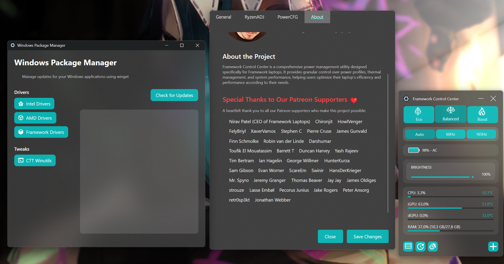

# Framework Hub

<div align="center">

<div style="background-color: #1a1b1e; padding: 20px; border-radius: 8px; margin-bottom: 20px;">


</div>

<div style="margin: 20px 0;">

</div>

<div style="margin: 25px 0;">
Built with ❤️ by <a href="https://patreon.com/Oganoth" style="color: #0D76A8; text-decoration: none; font-weight: 600;">John Dupuis</a>
</div>

<div style="margin: 40px 0;">

# 🙏 Special Thanks to Our Supporters

A heartfelt thank you to those who make this project possible:

**Nirav Patel** _(CEO of Framework Laptops)_, Chironjit, HowlVenger, FelyBriyl, XaverVamos, Stephen C, Pierre Cruse, James Gunvald, Finn Schmolke, Robin van der Linde, Darshumar, Toufik El Mouatassim, Barrett T, Duncan Harvey, Yash Rajeev, Tim Bertram, Ian Hagelin, George Willmer, HunterKurza, Sam Gibson, Evan Worner, ScareEm, Swinir, HansDerKrieger, Mr. Spyro, Jeremy Granger, Thomas Beaver, Jay Jay, James Oldiges, strouze, Lasse Embøl, Pecorus Junius, Jake Rogers, Peter Ansorg, retr0sp3kt, Jonathan Webber, Kashi Takashi, Eric Olsen, Greg Leask, Jake Fairbrother, Tobias Deyle, Hana Elena, Stephen Chuang.

<div style="margin: 30px 0;">
<a href="https://patreon.com/Oganoth">
  
</a>
</div>

</div>

<div style="margin: 30px 0; font-size: 16px;">

[Overview](#overview) • 
[Features](#-key-features) • 
[Installation](#-installation) • 
[Development Build](#-development-build) • 
[Usage](#-usage) • 
[Contributing](#-contributing) • 
[Support](#-support)

</div>

</div>

## Overview

Framework Hub is a powerful system management tool designed specifically for Framework laptops. Built with C# and Avalonia UI, it provides comprehensive control over power management, performance optimization, and hardware monitoring through an elegant, feature-rich interface.

### 🎯 Key Features

#### ⚡ Advanced CPU Management
- **Intel Core Support**:
  - Direct WinRing0 implementation
  - Native power limit control (PL1)
  - Secure Boot compatibility
  - Customizable power profiles (15W-115W)

- **AMD Ryzen Support**:
  - RyzenADJ integration
  - Framework 13 AMD (7640U/7840U) support
  - Framework 16 AMD (7840HS/7940HS) support
  - Custom power profiles

#### 🔋 Power Management
- **Framework-Optimized Power Plans**:
  - Framework-Eco: Battery optimization
  - Framework-Balanced: Intelligent scaling
  - Framework-Boost: Maximum performance

- **Advanced Power Features**:
  - Windows power plan synchronization
  - Dynamic processor states
  - Adaptive boost behavior
  - Core parking optimization

#### 💻 Hardware Support
- **Comprehensive CPU Support**:
  - Intel Core Ultra (125H, 155H, 165H)
  - Intel Core i5/i7 (1340P, 1360P, 1370P)
  - AMD Ryzen 7 (7640U/7840U, 7840HS/7940HS)

- **GPU Management**:
  - Intel Graphics optimization
  - AMD iGPU/dGPU support
  - Dynamic power states
  - Performance monitoring

#### 📊 Monitoring System
- **Real-time Metrics**:
  - CPU temperature and usage
  - GPU performance data
  - Memory utilization
  - Power consumption
  - System information

## 🔧 Installation

### Building from Source

#### Prerequisites
- Windows 11 (22H2 or later)
- Visual Studio 2022 or JetBrains Rider
- .NET 8.0 SDK
- Git

#### Steps
```bash
# Clone repository
git clone https://github.com/JohnDupuis/Framework-Hub.git
cd Framework-Hub

# Build solution
dotnet restore
dotnet build -c Release

# Run application
dotnet run -c Release
```

#### Required Dependencies
- .NET 8.0 Desktop Runtime
- Visual C++ Redistributable 2015-2022
- WinRing0 driver (included)

## 🚀 Development Build

A pre-compiled version with installer is available for Patreon supporters:

- Latest experimental features
- Easy one-click installer
- Priority support
- Early access to new features

[Get Development Build on Patreon](https://patreon.com/Oganoth)

## 📋 Usage

### First Launch
1. Run as administrator
2. Choose power profile
3. Customize settings if needed


### Important Notes
- Administrator rights required
- Some features may be locked by BIOS
- Regular backups recommended
- Experimental features may need testing

## 🤝 Contributing

### Development
1. Fork repository
2. Create feature branch
3. Submit pull request

### Other Ways to Help
- Report issues
- Suggest features
- Improve documentation
- Create power profiles
- Share experiences

## ❤️ Support

Framework Hub is a passion project that requires significant time and effort. Your support helps:
- Develop new features
- Improve stability
- Provide better support
- Create documentation

[Support on Patreon](https://patreon.com/Oganoth)

## 📜 License

This project is licensed under the MIT License - see the [LICENSE](LICENSE) file for details. 
