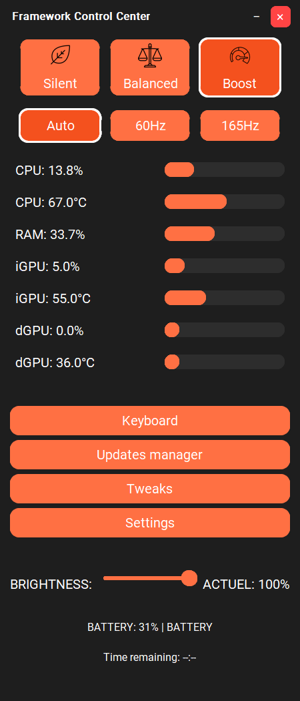
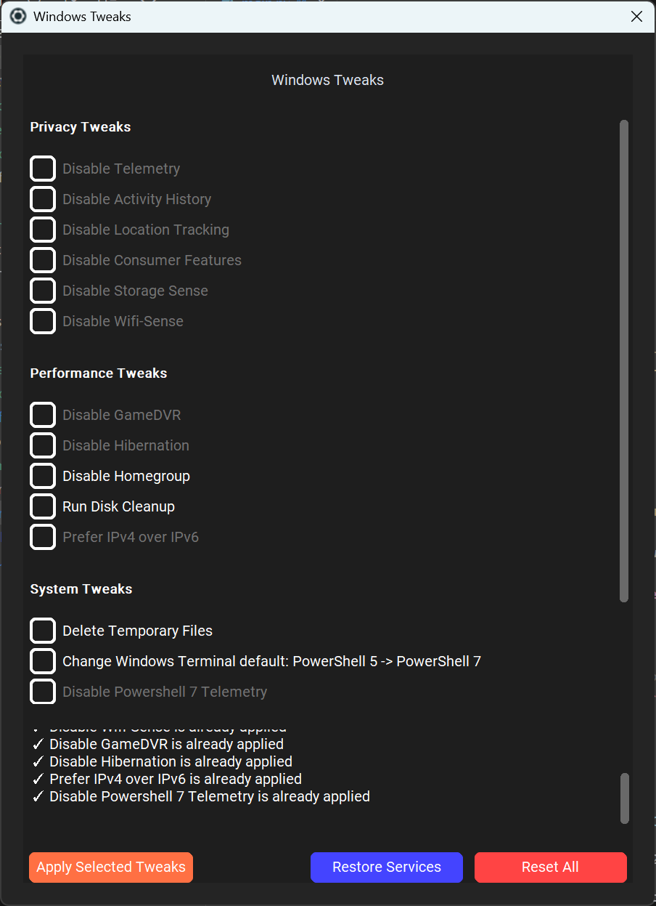

# Framework Hub Mini

<div align="center">




<p align="center">
  <a href="#english">English</a> •
  <a href="#français">Français</a> •
  <a href="#-key-features">Features</a> •
  <a href="#-installation">Install</a> •
  <a href="#-usage">Usage</a> •
  <a href="#-contributing">Contribute</a> •
  <a href="#-support">Support</a>
</p>

</div>

<div align="center">
  <sub>Built with ❤️ by <a href="https://patreon.com/Oganoth">Oganoth</a> and <a href="#-acknowledgments">contributors</a></sub>
</div>

<hr>

## English

### 🎯 Overview

Framework Hub Mini is a powerful system management tool designed specifically for Framework AMD laptops. Built with Python and modern UI components, it provides comprehensive control over power management, performance optimization, and hardware monitoring through an elegant, feature-rich interface.

### 📸 Screenshots

<div align="center">
<p float="left">
  

  
</p>
<p float="left">
  

  <em>Framework Hub Mini in action - Control, Monitor, and Optimize your laptop</em>
</p>
</div>

### ✨ Key Features

<details>
<summary>🔋 Power Management</summary>

#### Advanced Power Profiles
- **Framework 13 AMD (7640U/7840U)**:
  - Silent/ECO (15W TDP)
  - Balanced (25W TDP)
  - Boost (28W TDP)
- **Framework 16 AMD (7840HS/7940HS)**:
  - Silent/ECO (30W TDP)
  - Balanced (95W TDP)
  - Boost (120W TDP)
- **Framework 13 Intel** (WIP):
  - Silent (PL1: 10W, PL2: 15W)
  - Balanced (PL1: 20W, PL2: 40W)
  - Boost (PL1: 28W, PL2: 55W)
</details>

<details>
<summary>💻 Hardware Control</summary>

- **CPU Management**
  - Real-time frequency control 
  - Temperature monitoring
  - Core parking optimization
- **GPU Control**
  - iGPU frequency management
  - Temperature monitoring
- **Fan Control**
  - Custom fan curves
  - Temperature-based adjustment
</details>

<details>
<summary>🖥️ Display Management</summary>

- **Advanced Display Control**
  - Dynamic refresh rate (60Hz-165Hz)
  - Power-source based automation
  - Brightness control with hotkeys
- **Multi-Monitor Support**
  - External display detection
  - Resolution management
</details>

<details>
<summary>⚡ System Optimization</summary>

- **Performance Monitoring**
  - Real-time CPU/GPU metrics
  - Power consumption tracking
  - Temperature monitoring
- **Power Optimization**
  - Battery charge limiting
  - Power plan automation
</details>

### 🛠️ Technical Details

<details>
<summary>View Dependencies</summary>

```python
customtkinter>=5.2.0    # Modern UI framework
pydantic>=2.5.0        # Data validation
requests>=2.31.0       # Network operations
psutil>=5.9.0         # System monitoring
Pillow>=10.0.0        # Image processing
aiohttp>=3.9.0        # Async HTTP client
pywin32>=306          # Windows API integration
wmi>=1.5.1            # Hardware information
comtypes>=1.2.0       # COM interface
pythonnet>=3.0.3      # .NET integration
pystray>=0.19.4       # System tray
keyboard>=0.13.5      # Hotkey support
```
</details>

### 🔧 Installation

<details>
<summary>View Installation Steps</summary>

#### Prerequisites
- Windows 11 (22H2 or later)
- Administrator privileges
- .NET Framework 4.8
- Visual C++ Redistributable 2015-2022

#### Python Edition (Open Source)
```bash
# Clone repository
git clone https://github.com/Oganoth/Framework-Hub-PY.git
cd Framework-Hub-PY

# Install dependencies
pip install -r requirements.txt

# Run application
python main.py
```

#### Framework-Hub.exe (Easy Install)
Download the all-in-one installer from [Patreon](https://patreon.com/Oganoth)
</details>

### 📋 Usage

<details>
<summary>View Usage Guide</summary>

1. **First Launch**
   - Run as administrator
   - Hardware detection is automatic
   - Initial configuration wizard

2. **Daily Use**
   - Access via system tray
   - Quick profile switching
   - Real-time monitoring

3. **Advanced Features**
   - Create custom power profiles
   - Configure fan curves
   - Set up automation rules
</details>

### 🤝 Contributing

<details>
<summary>How to Contribute</summary>

We welcome all contributions! Here's how you can help:

#### Code Contributions
1. Fork the repository
2. Create a feature branch
3. Add your improvements
4. Submit a pull request

#### Other Ways to Help
- Report bugs and issues
- Suggest new features
- Improve documentation
- Help with translations
</details>

### ❤️ Support

<div align="center">

[](https://patreon.com/Oganoth)

</div>

Framework Hub Mini is a passion project that requires significant time and effort. Your support helps:
- Develop new features
- Improve existing functionality
- Provide faster support
- Create better documentation

### 📜 License

This project is licensed under the GNU General Public License v3.0 - see the [LICENSE](LICENSE) file for details.

<hr>

